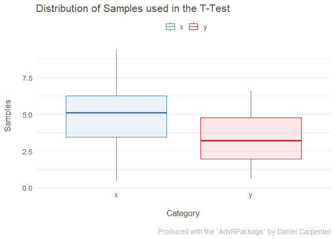

Package 1 Progress (Installment 3)
================
Author: Daniel Carpenter
April 19, 2023

- <a href="#requirements" id="toc-requirements">Requirements</a>
- <a href="#solution" id="toc-solution">Solution</a>
  - <a href="#packages" id="toc-packages">Packages</a>
  - <a href="#testing-the-package" id="toc-testing-the-package">Testing the
    Package</a>
    - <a href="#check-function" id="toc-check-function"><code>check</code>
      Function</a>
    - <a href="#print-functions" id="toc-print-functions">Print Functions</a>
    - <a href="#create-sample-data" id="toc-create-sample-data">Create Sample
      Data</a>
    - <a href="#call-the-constructor" id="toc-call-the-constructor">Call the
      Constructor</a>
    - <a href="#print-the-output" id="toc-print-the-output">Print the
      Output</a>
    - <a href="#plot-the-output" id="toc-plot-the-output">Plot the Output</a>

> This report shows the third installment of the Advanced R’s R Package
> Creation

# Requirements

- Includes a demonstration of an R package that contains the constructor
  and print method.
- R package GitHub link:
  <https://github.com/Daniel-Carpenter/AdvRPackage>

------------------------------------------------------------------------

<br>

# Solution

## Packages

``` r
library(devtools)    # check function
library(sloop)       # Checking the dispatch of functions
library(AdvRPackage) # My package: https://github.com/Daniel-Carpenter/AdvRPackage
```

## Testing the Package

### `check` Function

``` r
# Check the current (or package) directory containing the R package
devtools::check(".") 
```

    ## ══ Documenting ═════════════════════════════════════════════════════════════════
    ## 
    ## ══ Building ════════════════════════════════════════════════════════════════════
    ## Setting env vars:
    ## • CFLAGS    : -Wall -pedantic
    ## • CXXFLAGS  : -Wall -pedantic
    ## • CXX11FLAGS: -Wall -pedantic
    ## • CXX14FLAGS: -Wall -pedantic
    ## • CXX17FLAGS: -Wall -pedantic
    ## • CXX20FLAGS: -Wall -pedantic
    ## * checking for file 'C:\Users\daniel.carpenter\OneDrive - the Chickasaw Nation\Documents\GitHub\OU-DSA\AdvRPackage/DESCRIPTION' ... OK
    ## * preparing 'AdvRPackage':
    ## * checking DESCRIPTION meta-information ... OK
    ## * checking for LF line-endings in source and make files and shell scripts
    ## * checking for empty or unneeded directories
    ## Omitted 'LazyData' from DESCRIPTION
    ## * building 'AdvRPackage_0.1.0.tar.gz'
    ## 
    ## ══ Checking ════════════════════════════════════════════════════════════════════
    ## Setting env vars:
    ## • _R_CHECK_CRAN_INCOMING_REMOTE_: FALSE
    ## • _R_CHECK_CRAN_INCOMING_       : FALSE
    ## • _R_CHECK_FORCE_SUGGESTS_      : FALSE
    ## • NOT_CRAN                      : true
    ## ── R CMD check ─────────────────────────────────────────────────────────────────
    ## * using log directory 'C:/Users/daniel.carpenter/AppData/Local/Temp/RtmpOYuwOr/AdvRPackage.Rcheck'
    ## * using R version 4.2.3 (2023-03-15 ucrt)
    ## * using platform: x86_64-w64-mingw32 (64-bit)
    ## * using session charset: UTF-8
    ## * using options '--no-manual --as-cran'
    ## * checking for file 'AdvRPackage/DESCRIPTION' ... OK
    ## * checking extension type ... Package
    ## * this is package 'AdvRPackage' version '0.1.0'
    ## * package encoding: UTF-8
    ## * checking package namespace information ... OK
    ## * checking package dependencies ... OK
    ## * checking if this is a source package ... OK
    ## * checking if there is a namespace ... OK
    ## * checking for executable files ... OK
    ## * checking for hidden files and directories ... OK
    ## * checking for portable file names ... OK
    ## * checking serialization versions ... OK
    ## * checking whether package 'AdvRPackage' can be installed ... OK
    ## * checking installed package size ... OK
    ## * checking package directory ... OK
    ## * checking for future file timestamps ... OK
    ## * checking DESCRIPTION meta-information ... NOTE
    ## License components which are templates and need '+ file LICENSE':
    ##   MIT
    ## * checking top-level files ... NOTE
    ## Non-standard files/directories found at top level:
    ##   'Installment-3-Daniel-Carpenter.html' 'README.Rmd' 'README.html'
    ## * checking for left-over files ... OK
    ## * checking index information ... OK
    ## * checking package subdirectories ... OK
    ## * checking R files for non-ASCII characters ... OK
    ## * checking R files for syntax errors ... OK
    ## * checking whether the package can be loaded ... OK
    ## * checking whether the package can be loaded with stated dependencies ... OK
    ## * checking whether the package can be unloaded cleanly ... OK
    ## * checking whether the namespace can be loaded with stated dependencies ... OK
    ## * checking whether the namespace can be unloaded cleanly ... OK
    ## * checking loading without being on the library search path ... OK
    ## * checking dependencies in R code ... OK
    ## * checking S3 generic/method consistency ... OK
    ## * checking replacement functions ... OK
    ## * checking foreign function calls ... OK
    ## * checking R code for possible problems ... NOTE
    ## plot.Rttest: no visible global function definition for 'where'
    ## plot.Rttest: no visible binding for global variable 'sampleNames'
    ## plot.Rttest: no visible binding for global variable 'sampleValues'
    ## Undefined global functions or variables:
    ##   sampleNames sampleValues where
    ## * checking Rd files ... OK
    ## * checking Rd metadata ... OK
    ## * checking Rd line widths ... OK
    ## * checking Rd cross-references ... OK
    ## * checking for missing documentation entries ... OK
    ## * checking for code/documentation mismatches ... OK
    ## * checking Rd \usage sections ... OK
    ## * checking Rd contents ... OK
    ## * checking for unstated dependencies in examples ... OK
    ## * checking examples ... OK
    ## * checking for non-standard things in the check directory ... OK
    ## * checking for detritus in the temp directory ... OK
    ## * DONE
    ## Status: 3 NOTEs
    ## See
    ##   'C:/Users/daniel.carpenter/AppData/Local/Temp/RtmpOYuwOr/AdvRPackage.Rcheck/00check.log'
    ## for details.

    ## ── R CMD check results ────────────────────────────────── AdvRPackage 0.1.0 ────
    ## Duration: 36.3s
    ## 
    ## ❯ checking DESCRIPTION meta-information ... NOTE
    ##   License components which are templates and need '+ file LICENSE':
    ##     MIT
    ## 
    ## ❯ checking top-level files ... NOTE
    ##   Non-standard files/directories found at top level:
    ##     'Installment-3-Daniel-Carpenter.html' 'README.Rmd' 'README.html'
    ## 
    ## ❯ checking R code for possible problems ... NOTE
    ##   plot.Rttest: no visible global function definition for 'where'
    ##   plot.Rttest: no visible binding for global variable 'sampleNames'
    ##   plot.Rttest: no visible binding for global variable 'sampleValues'
    ##   Undefined global functions or variables:
    ##     sampleNames sampleValues where
    ## 
    ## 0 errors ✔ | 0 warnings ✔ | 3 notes ✖

### Print Functions

``` r
# myttest function
print(AdvRPackage::myttest)
```

    ## function(x, y, alpha = 0.05) {
    ## 
    ##   # Check if x and y are numeric vectors
    ##   if (!is.numeric(x) || !is.numeric(y)) {
    ##     stop("x and y must be numeric vectors.")
    ##   }
    ## 
    ##   # Perform a two-sample t-test on x and y
    ##   performTTest <- function(x, y, alpha) {
    ## 
    ##     # Assume that the variances in the population are the same (this will mean a simple no conditional function)
    ##     tTestResults <- stats::t.test(x, y, var.equal = TRUE)
    ## 
    ##     # Reteive Confidence interval and p value
    ##     ci     = tTestResults[['conf.int']]
    ##     pValue = tTestResults[['p.value']]
    ## 
    ##     # Return the test type (name), t-test output, and if we rejected the null
    ##     return(list(ci           = ci,
    ##                 pValue       = pValue,
    ##                 tTestResults = tTestResults
    ##     )
    ##     )
    ##   }
    ## 
    ##   # Call the performTTest function and store the results in testResult
    ##   testResult <- performTTest(x, y, alpha)
    ## 
    ##   # Create a results list of the test results and input data
    ##   result <- list(
    ##     data         = data.frame(x = x, y = y),
    ##     alpha        = alpha,
    ##     ci           = testResult$ci,
    ##     pValue       = testResult$pValue
    ##   )
    ## 
    ##   # Set the class of the result object to "Rttest"
    ##   class(result) <- "Rttest"
    ## 
    ##   # Return the result object invisibly
    ##   return(invisible(result))
    ## }
    ## <environment: namespace:AdvRPackage>

``` r
# print method
print(AdvRPackage::print)
```

    ## function(Rttest_obj, roundToDigits = 3) {
    ##   UseMethod("print")
    ## }
    ## <environment: namespace:AdvRPackage>

### Create Sample Data

``` r
# X Variable
set.seed(21)
x <- rnorm(30,5,2)

# Y Variable
set.seed(23)
y <- rnorm(30, 3,2)

# Alpha level
alpha <- 0.05
```

### Call the Constructor

``` r
# Call the contructor
obj <- AdvRPackage::myttest(x = x, y = y, alpha = 0.05)
```

### Print the Output

``` r
class(obj)
```

    ## [1] "Rttest"

``` r
print(obj)
```

<table>
<caption>
Rttest Printed Data. Note rounded to 3 digits
</caption>
<thead>
<tr>
<th style="text-align:right;">
x
</th>
<th style="text-align:right;">
y
</th>
</tr>
</thead>
<tbody>
<tr>
<td style="text-align:right;">
6.586
</td>
<td style="text-align:right;">
3.386
</td>
</tr>
<tr>
<td style="text-align:right;">
6.045
</td>
<td style="text-align:right;">
2.131
</td>
</tr>
<tr>
<td style="text-align:right;">
8.492
</td>
<td style="text-align:right;">
4.827
</td>
</tr>
<tr>
<td style="text-align:right;">
2.457
</td>
<td style="text-align:right;">
6.587
</td>
</tr>
<tr>
<td style="text-align:right;">
9.395
</td>
<td style="text-align:right;">
4.993
</td>
</tr>
<tr>
<td style="text-align:right;">
5.866
</td>
<td style="text-align:right;">
5.215
</td>
</tr>
<tr>
<td style="text-align:right;">
1.860
</td>
<td style="text-align:right;">
2.444
</td>
</tr>
<tr>
<td style="text-align:right;">
3.130
</td>
<td style="text-align:right;">
5.038
</td>
</tr>
<tr>
<td style="text-align:right;">
5.127
</td>
<td style="text-align:right;">
3.091
</td>
</tr>
<tr>
<td style="text-align:right;">
4.995
</td>
<td style="text-align:right;">
6.152
</td>
</tr>
<tr>
<td style="text-align:right;">
0.446
</td>
<td style="text-align:right;">
3.437
</td>
</tr>
<tr>
<td style="text-align:right;">
6.515
</td>
<td style="text-align:right;">
0.907
</td>
</tr>
<tr>
<td style="text-align:right;">
3.903
</td>
<td style="text-align:right;">
2.423
</td>
</tr>
<tr>
<td style="text-align:right;">
5.345
</td>
<td style="text-align:right;">
3.963
</td>
</tr>
<tr>
<td style="text-align:right;">
6.126
</td>
<td style="text-align:right;">
0.567
</td>
</tr>
<tr>
<td style="text-align:right;">
8.024
</td>
<td style="text-align:right;">
3.616
</td>
</tr>
<tr>
<td style="text-align:right;">
6.318
</td>
<td style="text-align:right;">
1.960
</td>
</tr>
<tr>
<td style="text-align:right;">
7.244
</td>
<td style="text-align:right;">
2.115
</td>
</tr>
<tr>
<td style="text-align:right;">
3.431
</td>
<td style="text-align:right;">
1.801
</td>
</tr>
<tr>
<td style="text-align:right;">
4.149
</td>
<td style="text-align:right;">
5.589
</td>
</tr>
<tr>
<td style="text-align:right;">
5.786
</td>
<td style="text-align:right;">
4.671
</td>
</tr>
<tr>
<td style="text-align:right;">
5.074
</td>
<td style="text-align:right;">
1.868
</td>
</tr>
<tr>
<td style="text-align:right;">
2.936
</td>
<td style="text-align:right;">
4.577
</td>
</tr>
<tr>
<td style="text-align:right;">
2.470
</td>
<td style="text-align:right;">
0.668
</td>
</tr>
<tr>
<td style="text-align:right;">
4.546
</td>
<td style="text-align:right;">
1.938
</td>
</tr>
<tr>
<td style="text-align:right;">
6.491
</td>
<td style="text-align:right;">
2.998
</td>
</tr>
<tr>
<td style="text-align:right;">
5.666
</td>
<td style="text-align:right;">
1.975
</td>
</tr>
<tr>
<td style="text-align:right;">
2.752
</td>
<td style="text-align:right;">
5.486
</td>
</tr>
<tr>
<td style="text-align:right;">
3.588
</td>
<td style="text-align:right;">
1.679
</td>
</tr>
<tr>
<td style="text-align:right;">
3.545
</td>
<td style="text-align:right;">
3.333
</td>
</tr>
</tbody>
</table>

``` r
s3_dispatch( print(obj) ) # Note the dispatch
```

    ## => print.Rttest
    ##  * print.default

### Plot the Output

``` r
plot(obj)
```

<!-- -->

``` r
s3_dispatch( plot(obj) ) # Note the dispatch
```

    ## => plot.Rttest
    ##  * plot.default
