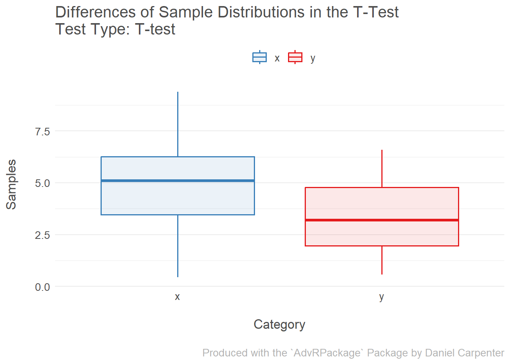
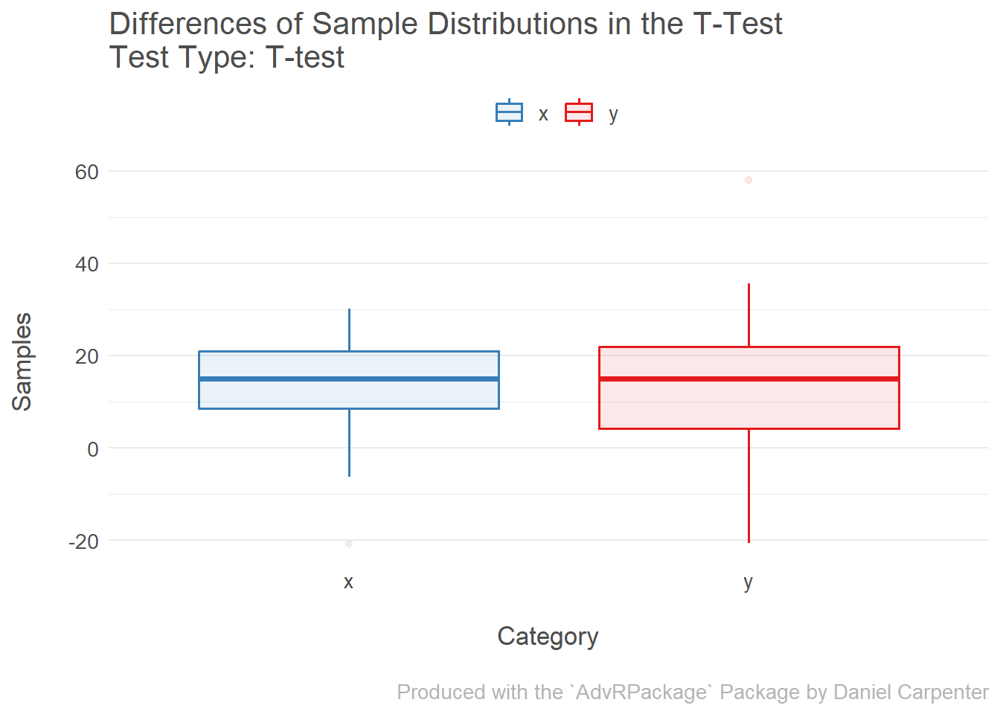
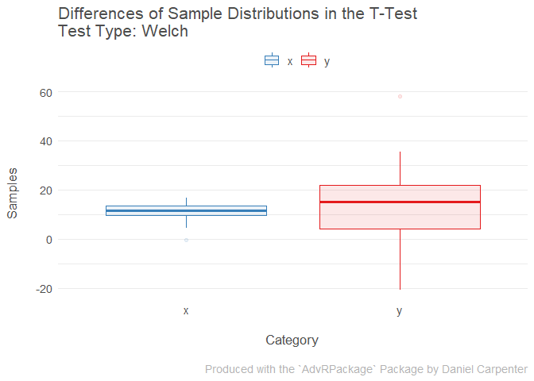
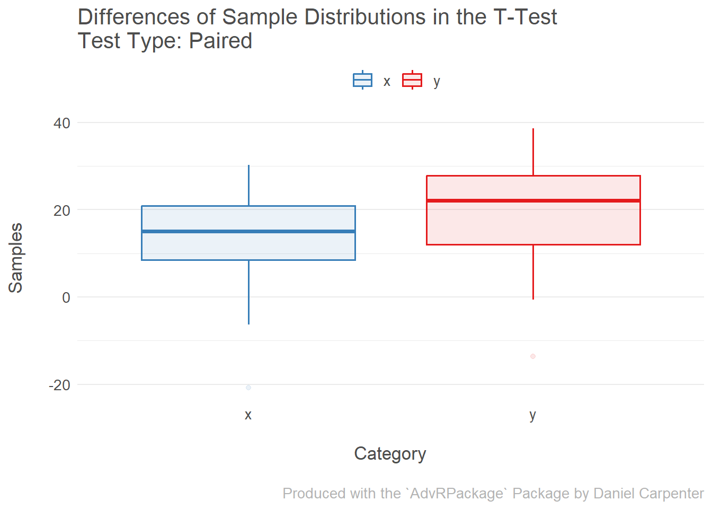
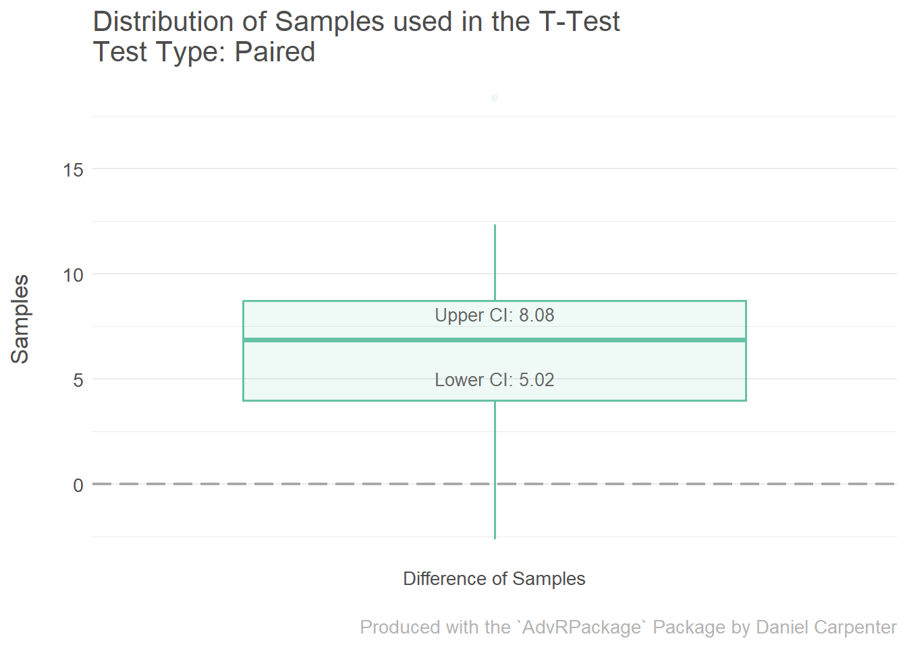

AdvRPackage
================
Author: Daniel Carpenter
April 20, 2023

- <a href="#advrpackage" id="toc-advrpackage"><code>AdvRPackage</code></a>
  - <a href="#installation" id="toc-installation">Installation</a>
  - <a href="#installment-4-requirements"
    id="toc-installment-4-requirements">Installment 4 Requirements</a>
    - <a href="#load-package" id="toc-load-package">Load Package</a>
    - <a href="#printed-functions" id="toc-printed-functions">Printed
      Functions</a>
    - <a href="#run-the-code-for-installment-4"
      id="toc-run-the-code-for-installment-4">Run the code for Installment
      4</a>
  - <a href="#examples-for-final-package"
    id="toc-examples-for-final-package">Examples (For Final Package)</a>
    - <a href="#load-package-1" id="toc-load-package-1">Load Package</a>
    - <a href="#test-1---default-t-test" id="toc-test-1---default-t-test">Test
      <code>1</code> - Default T-Test</a>
    - <a href="#test-2---welch-t-test" id="toc-test-2---welch-t-test">Test
      <code>2</code> - Welch T-Test</a>
    - <a href="#test-3---paired-t-test" id="toc-test-3---paired-t-test">Test
      <code>3</code> - Paired T-Test</a>

<!-- README.md is generated from README.Rmd. Please edit that file -->

# `AdvRPackage`

<!-- badges: start -->
<!-- badges: end -->

## Installation

You can install the development version of `AdvRPackage` from
[GitHub](https://github.com/Daniel-Carpenter/AdvRPackage.git) with:

``` r
# install.packages("devtools")
devtools::install_github("Daniel-Carpenter/AdvRPackage")
```

## Installment 4 Requirements

### Load Package

``` r
library(AdvRPackage) # My package: https://github.com/Daniel-Carpenter/AdvRPackage
```

### Printed Functions

``` r
# Print function
print(AdvRPackage::myttest)
#> function(x, y, alpha = 0.05, paired = FALSE) {
#> 
#>   # Check if x and y are numeric vectors
#>   if (!is.numeric(x) || !is.numeric(y)) {
#>     stop("x and y must be numeric vectors.")
#>   }
#> 
#> 
#>   # Check the variances of x and y and determine which type of t-test to perform
#>   variancesAreNotEqual <- function(x, y, alpha) {
#> 
#>     # Check the variances of x and y using an F-test
#>     fTest <- var.test(x, y)
#> 
#>     # Return TRUE if the p-value is less than alpha, indicating unequal variances
#>     return(fTest$p.value < alpha)
#>   }
#> 
#>   # Perform a two-sample t-test on x and y
#>   performTTest <- function(x, y, alpha, paired) {
#> 
#>     # 0. Check if variances equal or not
#>     variancesNotEqual <- variancesAreNotEqual(x, y, alpha)
#> 
#>     # 1. Discover which t test to use
#> 
#>     ## 1.1 If paired in paraeters, then paired
#>     if (paired) {
#>       testType     <- 'Paired'
#>       tTestResults <- t.test(x, y, paired = TRUE)
#> 
#>       ## 1.2 Else If variances are not equal then use Welch's T-Test
#>     } else if (variancesNotEqual) {
#>       testType     <- 'Welch'
#>       tTestResults <- t.test(x, y, var.equal = FALSE)
#> 
#>       ## 1.3 Else variances are equal and not using a paired ttest, so use standard
#>     } else {
#>       testType     <- 'T-test'
#>       tTestResults <- t.test(x, y, var.equal = TRUE)
#>     }
#> 
#>     # Determine if the null hypothesis is rejected based on the p-value
#>     rejectNull <- if_else(tTestResults$p.value < alpha, "Y", "N")
#> 
#>     # Confidence interval and p value
#>     ci     = tTestResults[['conf.int']]
#>     pValue = tTestResults[['p.value']]
#> 
#>     # Return the test type (name), t-test output, and if we rejected the null
#>     return(list(ci           = ci,
#>                 pValue       = pValue,
#>                 testType     = testType,
#>                 tTestResults = tTestResults,
#>                 rejectNull   = rejectNull
#>     )
#>     )
#>   }
#> 
#>   # Call the performTTest function and store the results in testResult
#>   testResult <- performTTest(x, y, alpha, paired)
#> 
#>   # Create a results list of the test results and input data
#>   result <- list(
#>     data         = data.frame(x = x, y = y),
#>     alpha        = alpha,
#>     ci           = testResult$ci,
#>     pValue       = testResult$pValue,
#>     testType     = testResult$testType,
#>     summaryStats = testResult$tTestResults,
#>     rejectNull   = testResult$rejectNull
#>   )
#> 
#>   # Set the class of the result object to "Rttest"
#>   class(result) <- "Rttest"
#> 
#>   # Return the result object invisibly
#>   return(invisible(result))
#> }
#> <bytecode: 0x00000110479fcee0>
#> <environment: namespace:AdvRPackage>

# Print function
print(AdvRPackage::print)
#> function(Rttest_obj, roundToDigits = 3) {
#>   UseMethod("print")
#> }
#> <bytecode: 0x000001104bd87680>
#> <environment: namespace:AdvRPackage>

# Plot function
print(AdvRPackage::plot)
#> function(Rttest_obj) {
#>   UseMethod("plot")
#> }
#> <bytecode: 0x000001104be56f00>
#> <environment: namespace:AdvRPackage>
```

<br>

### Run the code for Installment 4

``` r
# Create sample data
set.seed(21); x <- rnorm(30, 5, 2); 
set.seed(23); y <- rnorm(30, 3, 2); alpha <- 0.05

# Run the t-test function using this package
obj <- AdvRPackage::myttest(x = x, y = y, alpha = 0.05)

# Print Method 
print(obj)
```

<table>
 <thead>
  <tr>
   <th style="text-align:right;"> Alpha </th>
  </tr>
 </thead>
<tbody>
  <tr>
   <td style="text-align:right;"> 95 </td>
  </tr>
</tbody>
</table>
<table>
 <thead>
  <tr>
   <th style="text-align:right;"> Confidence_Interval </th>
  </tr>
 </thead>
<tbody>
  <tr>
   <td style="text-align:right;"> 0.656 </td>
  </tr>
  <tr>
   <td style="text-align:right;"> 2.602 </td>
  </tr>
</tbody>
</table>
<table>
<caption>Rttest Data</caption>
 <thead>
  <tr>
   <th style="text-align:right;"> x </th>
   <th style="text-align:right;"> y </th>
  </tr>
 </thead>
<tbody>
  <tr>
   <td style="text-align:right;"> 6.586 </td>
   <td style="text-align:right;"> 3.386 </td>
  </tr>
  <tr>
   <td style="text-align:right;"> 6.045 </td>
   <td style="text-align:right;"> 2.131 </td>
  </tr>
  <tr>
   <td style="text-align:right;"> 8.492 </td>
   <td style="text-align:right;"> 4.827 </td>
  </tr>
  <tr>
   <td style="text-align:right;"> 2.457 </td>
   <td style="text-align:right;"> 6.587 </td>
  </tr>
  <tr>
   <td style="text-align:right;"> 9.395 </td>
   <td style="text-align:right;"> 4.993 </td>
  </tr>
  <tr>
   <td style="text-align:right;"> 5.866 </td>
   <td style="text-align:right;"> 5.215 </td>
  </tr>
  <tr>
   <td style="text-align:right;"> 1.860 </td>
   <td style="text-align:right;"> 2.444 </td>
  </tr>
  <tr>
   <td style="text-align:right;"> 3.130 </td>
   <td style="text-align:right;"> 5.038 </td>
  </tr>
  <tr>
   <td style="text-align:right;"> 5.127 </td>
   <td style="text-align:right;"> 3.091 </td>
  </tr>
  <tr>
   <td style="text-align:right;"> 4.995 </td>
   <td style="text-align:right;"> 6.152 </td>
  </tr>
  <tr>
   <td style="text-align:right;"> 0.446 </td>
   <td style="text-align:right;"> 3.437 </td>
  </tr>
  <tr>
   <td style="text-align:right;"> 6.515 </td>
   <td style="text-align:right;"> 0.907 </td>
  </tr>
  <tr>
   <td style="text-align:right;"> 3.903 </td>
   <td style="text-align:right;"> 2.423 </td>
  </tr>
  <tr>
   <td style="text-align:right;"> 5.345 </td>
   <td style="text-align:right;"> 3.963 </td>
  </tr>
  <tr>
   <td style="text-align:right;"> 6.126 </td>
   <td style="text-align:right;"> 0.567 </td>
  </tr>
  <tr>
   <td style="text-align:right;"> 8.024 </td>
   <td style="text-align:right;"> 3.616 </td>
  </tr>
  <tr>
   <td style="text-align:right;"> 6.318 </td>
   <td style="text-align:right;"> 1.960 </td>
  </tr>
  <tr>
   <td style="text-align:right;"> 7.244 </td>
   <td style="text-align:right;"> 2.115 </td>
  </tr>
  <tr>
   <td style="text-align:right;"> 3.431 </td>
   <td style="text-align:right;"> 1.801 </td>
  </tr>
  <tr>
   <td style="text-align:right;"> 4.149 </td>
   <td style="text-align:right;"> 5.589 </td>
  </tr>
  <tr>
   <td style="text-align:right;"> 5.786 </td>
   <td style="text-align:right;"> 4.671 </td>
  </tr>
  <tr>
   <td style="text-align:right;"> 5.074 </td>
   <td style="text-align:right;"> 1.868 </td>
  </tr>
  <tr>
   <td style="text-align:right;"> 2.936 </td>
   <td style="text-align:right;"> 4.577 </td>
  </tr>
  <tr>
   <td style="text-align:right;"> 2.470 </td>
   <td style="text-align:right;"> 0.668 </td>
  </tr>
  <tr>
   <td style="text-align:right;"> 4.546 </td>
   <td style="text-align:right;"> 1.938 </td>
  </tr>
  <tr>
   <td style="text-align:right;"> 6.491 </td>
   <td style="text-align:right;"> 2.998 </td>
  </tr>
  <tr>
   <td style="text-align:right;"> 5.666 </td>
   <td style="text-align:right;"> 1.975 </td>
  </tr>
  <tr>
   <td style="text-align:right;"> 2.752 </td>
   <td style="text-align:right;"> 5.486 </td>
  </tr>
  <tr>
   <td style="text-align:right;"> 3.588 </td>
   <td style="text-align:right;"> 1.679 </td>
  </tr>
  <tr>
   <td style="text-align:right;"> 3.545 </td>
   <td style="text-align:right;"> 3.333 </td>
  </tr>
</tbody>
</table>

``` r
plot(obj)
#> $boxplots_distributions
```



<br>

## Examples (For Final Package)

> Note that this section may not be required for Installment 4, but is
> required for the final installment

### Load Package

``` r
library(AdvRPackage) # My package: https://github.com/Daniel-Carpenter/AdvRPackage
```

<br>

------------------------------------------------------------------------

### Test `1` - Default T-Test

- Notice the *non*-disparate distributions. The program will detect
  *equal* variances and use a `Default` T-Test.

``` r
# Create sample data
set.seed(32); x = rnorm(30, mean = 10, sd = 15)
set.seed(35); y = rnorm(30, mean = 8, sd = 15)

# Run the t-test function using this package
ans1 = AdvRPackage::myttest(x, y, alpha = 0.05, paired = FALSE)

# Print Method 
print(ans1)
```

<table>
 <thead>
  <tr>
   <th style="text-align:right;"> Alpha </th>
  </tr>
 </thead>
<tbody>
  <tr>
   <td style="text-align:right;"> 95 </td>
  </tr>
</tbody>
</table>
<table>
 <thead>
  <tr>
   <th style="text-align:right;"> Confidence_Interval </th>
  </tr>
 </thead>
<tbody>
  <tr>
   <td style="text-align:right;"> -7.623 </td>
  </tr>
  <tr>
   <td style="text-align:right;"> 6.100 </td>
  </tr>
</tbody>
</table>
<table>
<caption>Rttest Data</caption>
 <thead>
  <tr>
   <th style="text-align:right;"> x </th>
   <th style="text-align:right;"> y </th>
  </tr>
 </thead>
<tbody>
  <tr>
   <td style="text-align:right;"> 10.220 </td>
   <td style="text-align:right;"> 23.977 </td>
  </tr>
  <tr>
   <td style="text-align:right;"> 23.099 </td>
   <td style="text-align:right;"> 9.993 </td>
  </tr>
  <tr>
   <td style="text-align:right;"> -5.419 </td>
   <td style="text-align:right;"> 7.489 </td>
  </tr>
  <tr>
   <td style="text-align:right;"> 20.285 </td>
   <td style="text-align:right;"> 7.325 </td>
  </tr>
  <tr>
   <td style="text-align:right;"> 16.742 </td>
   <td style="text-align:right;"> 58.068 </td>
  </tr>
  <tr>
   <td style="text-align:right;"> 16.105 </td>
   <td style="text-align:right;"> 2.106 </td>
  </tr>
  <tr>
   <td style="text-align:right;"> 14.271 </td>
   <td style="text-align:right;"> 14.158 </td>
  </tr>
  <tr>
   <td style="text-align:right;"> 0.635 </td>
   <td style="text-align:right;"> -0.433 </td>
  </tr>
  <tr>
   <td style="text-align:right;"> 22.595 </td>
   <td style="text-align:right;"> 25.868 </td>
  </tr>
  <tr>
   <td style="text-align:right;"> 14.669 </td>
   <td style="text-align:right;"> 13.236 </td>
  </tr>
  <tr>
   <td style="text-align:right;"> 17.129 </td>
   <td style="text-align:right;"> 15.673 </td>
  </tr>
  <tr>
   <td style="text-align:right;"> 8.499 </td>
   <td style="text-align:right;"> 14.680 </td>
  </tr>
  <tr>
   <td style="text-align:right;"> 13.053 </td>
   <td style="text-align:right;"> -3.526 </td>
  </tr>
  <tr>
   <td style="text-align:right;"> 8.588 </td>
   <td style="text-align:right;"> 0.483 </td>
  </tr>
  <tr>
   <td style="text-align:right;"> 11.504 </td>
   <td style="text-align:right;"> -20.629 </td>
  </tr>
  <tr>
   <td style="text-align:right;"> 5.977 </td>
   <td style="text-align:right;"> -18.680 </td>
  </tr>
  <tr>
   <td style="text-align:right;"> 30.191 </td>
   <td style="text-align:right;"> 20.964 </td>
  </tr>
  <tr>
   <td style="text-align:right;"> 7.803 </td>
   <td style="text-align:right;"> 2.814 </td>
  </tr>
  <tr>
   <td style="text-align:right;"> 10.746 </td>
   <td style="text-align:right;"> 35.574 </td>
  </tr>
  <tr>
   <td style="text-align:right;"> 22.506 </td>
   <td style="text-align:right;"> 33.096 </td>
  </tr>
  <tr>
   <td style="text-align:right;"> 5.637 </td>
   <td style="text-align:right;"> 18.264 </td>
  </tr>
  <tr>
   <td style="text-align:right;"> -6.271 </td>
   <td style="text-align:right;"> 22.354 </td>
  </tr>
  <tr>
   <td style="text-align:right;"> 24.090 </td>
   <td style="text-align:right;"> 23.028 </td>
  </tr>
  <tr>
   <td style="text-align:right;"> 15.412 </td>
   <td style="text-align:right;"> 27.144 </td>
  </tr>
  <tr>
   <td style="text-align:right;"> 21.105 </td>
   <td style="text-align:right;"> 3.190 </td>
  </tr>
  <tr>
   <td style="text-align:right;"> 23.229 </td>
   <td style="text-align:right;"> 16.677 </td>
  </tr>
  <tr>
   <td style="text-align:right;"> 17.930 </td>
   <td style="text-align:right;"> 15.307 </td>
  </tr>
  <tr>
   <td style="text-align:right;"> -20.755 </td>
   <td style="text-align:right;"> 16.293 </td>
  </tr>
  <tr>
   <td style="text-align:right;"> 24.733 </td>
   <td style="text-align:right;"> 16.513 </td>
  </tr>
  <tr>
   <td style="text-align:right;"> 17.102 </td>
   <td style="text-align:right;"> 13.244 </td>
  </tr>
</tbody>
</table>

``` r
# Plot Method 
plot(ans1)
#> $boxplots_distributions
```



<br>

------------------------------------------------------------------------

### Test `2` - Welch T-Test

- Notice the *disparate* distributions. The program will detect
  *non*-equal variances and use a `Welch` T-Test.

``` r
# Create sample data
set.seed(32); x = rnorm(30, mean = 10, sd = 5)
set.seed(35); y = rnorm(30, mean = 8, sd = 15)

# Run the t-test function using this package
ans2 = AdvRPackage::myttest(x, y, alpha = 0.05, paired = FALSE)

# Print Method 
print(ans2)
```

<table>
 <thead>
  <tr>
   <th style="text-align:right;"> Alpha </th>
  </tr>
 </thead>
<tbody>
  <tr>
   <td style="text-align:right;"> 95 </td>
  </tr>
</tbody>
</table>
<table>
 <thead>
  <tr>
   <th style="text-align:right;"> Confidence_Interval </th>
  </tr>
 </thead>
<tbody>
  <tr>
   <td style="text-align:right;"> -8.672 </td>
  </tr>
  <tr>
   <td style="text-align:right;"> 3.087 </td>
  </tr>
</tbody>
</table>
<table>
<caption>Rttest Data</caption>
 <thead>
  <tr>
   <th style="text-align:right;"> x </th>
   <th style="text-align:right;"> y </th>
  </tr>
 </thead>
<tbody>
  <tr>
   <td style="text-align:right;"> 10.073 </td>
   <td style="text-align:right;"> 23.977 </td>
  </tr>
  <tr>
   <td style="text-align:right;"> 14.366 </td>
   <td style="text-align:right;"> 9.993 </td>
  </tr>
  <tr>
   <td style="text-align:right;"> 4.860 </td>
   <td style="text-align:right;"> 7.489 </td>
  </tr>
  <tr>
   <td style="text-align:right;"> 13.428 </td>
   <td style="text-align:right;"> 7.325 </td>
  </tr>
  <tr>
   <td style="text-align:right;"> 12.247 </td>
   <td style="text-align:right;"> 58.068 </td>
  </tr>
  <tr>
   <td style="text-align:right;"> 12.035 </td>
   <td style="text-align:right;"> 2.106 </td>
  </tr>
  <tr>
   <td style="text-align:right;"> 11.424 </td>
   <td style="text-align:right;"> 14.158 </td>
  </tr>
  <tr>
   <td style="text-align:right;"> 6.878 </td>
   <td style="text-align:right;"> -0.433 </td>
  </tr>
  <tr>
   <td style="text-align:right;"> 14.198 </td>
   <td style="text-align:right;"> 25.868 </td>
  </tr>
  <tr>
   <td style="text-align:right;"> 11.556 </td>
   <td style="text-align:right;"> 13.236 </td>
  </tr>
  <tr>
   <td style="text-align:right;"> 12.376 </td>
   <td style="text-align:right;"> 15.673 </td>
  </tr>
  <tr>
   <td style="text-align:right;"> 9.500 </td>
   <td style="text-align:right;"> 14.680 </td>
  </tr>
  <tr>
   <td style="text-align:right;"> 11.018 </td>
   <td style="text-align:right;"> -3.526 </td>
  </tr>
  <tr>
   <td style="text-align:right;"> 9.529 </td>
   <td style="text-align:right;"> 0.483 </td>
  </tr>
  <tr>
   <td style="text-align:right;"> 10.501 </td>
   <td style="text-align:right;"> -20.629 </td>
  </tr>
  <tr>
   <td style="text-align:right;"> 8.659 </td>
   <td style="text-align:right;"> -18.680 </td>
  </tr>
  <tr>
   <td style="text-align:right;"> 16.730 </td>
   <td style="text-align:right;"> 20.964 </td>
  </tr>
  <tr>
   <td style="text-align:right;"> 9.268 </td>
   <td style="text-align:right;"> 2.814 </td>
  </tr>
  <tr>
   <td style="text-align:right;"> 10.249 </td>
   <td style="text-align:right;"> 35.574 </td>
  </tr>
  <tr>
   <td style="text-align:right;"> 14.169 </td>
   <td style="text-align:right;"> 33.096 </td>
  </tr>
  <tr>
   <td style="text-align:right;"> 8.546 </td>
   <td style="text-align:right;"> 18.264 </td>
  </tr>
  <tr>
   <td style="text-align:right;"> 4.576 </td>
   <td style="text-align:right;"> 22.354 </td>
  </tr>
  <tr>
   <td style="text-align:right;"> 14.697 </td>
   <td style="text-align:right;"> 23.028 </td>
  </tr>
  <tr>
   <td style="text-align:right;"> 11.804 </td>
   <td style="text-align:right;"> 27.144 </td>
  </tr>
  <tr>
   <td style="text-align:right;"> 13.702 </td>
   <td style="text-align:right;"> 3.190 </td>
  </tr>
  <tr>
   <td style="text-align:right;"> 14.410 </td>
   <td style="text-align:right;"> 16.677 </td>
  </tr>
  <tr>
   <td style="text-align:right;"> 12.643 </td>
   <td style="text-align:right;"> 15.307 </td>
  </tr>
  <tr>
   <td style="text-align:right;"> -0.252 </td>
   <td style="text-align:right;"> 16.293 </td>
  </tr>
  <tr>
   <td style="text-align:right;"> 14.911 </td>
   <td style="text-align:right;"> 16.513 </td>
  </tr>
  <tr>
   <td style="text-align:right;"> 12.367 </td>
   <td style="text-align:right;"> 13.244 </td>
  </tr>
</tbody>
</table>

``` r
# Plot Method 
plot(ans2)
#> $boxplots_distributions
```



<br>

------------------------------------------------------------------------

### Test `3` - Paired T-Test

- Notice that when a `Paired` T-Test is detected, it will plot the
  distribution of sample differences

``` r
# Create sample data
set.seed(32); x = rnorm(30, mean = 10, sd = 15)
set.seed(35); y = x + rnorm(30, 5 , 4)

# Run the t-test function using this package
ans3 = AdvRPackage::myttest(x, y, alpha = 0.05, paired = TRUE)

# Print Method
print(ans3)
```

<table>
 <thead>
  <tr>
   <th style="text-align:right;"> Alpha </th>
  </tr>
 </thead>
<tbody>
  <tr>
   <td style="text-align:right;"> 95 </td>
  </tr>
</tbody>
</table>
<table>
 <thead>
  <tr>
   <th style="text-align:right;"> Confidence_Interval </th>
  </tr>
 </thead>
<tbody>
  <tr>
   <td style="text-align:right;"> -8.082 </td>
  </tr>
  <tr>
   <td style="text-align:right;"> -5.015 </td>
  </tr>
</tbody>
</table>
<table>
<caption>Rttest Data</caption>
 <thead>
  <tr>
   <th style="text-align:right;"> x </th>
   <th style="text-align:right;"> y </th>
  </tr>
 </thead>
<tbody>
  <tr>
   <td style="text-align:right;"> 10.220 </td>
   <td style="text-align:right;"> 19.480 </td>
  </tr>
  <tr>
   <td style="text-align:right;"> 23.099 </td>
   <td style="text-align:right;"> 28.631 </td>
  </tr>
  <tr>
   <td style="text-align:right;"> -5.419 </td>
   <td style="text-align:right;"> -0.555 </td>
  </tr>
  <tr>
   <td style="text-align:right;"> 20.285 </td>
   <td style="text-align:right;"> 25.105 </td>
  </tr>
  <tr>
   <td style="text-align:right;"> 16.742 </td>
   <td style="text-align:right;"> 35.093 </td>
  </tr>
  <tr>
   <td style="text-align:right;"> 16.105 </td>
   <td style="text-align:right;"> 19.534 </td>
  </tr>
  <tr>
   <td style="text-align:right;"> 14.271 </td>
   <td style="text-align:right;"> 20.913 </td>
  </tr>
  <tr>
   <td style="text-align:right;"> 0.635 </td>
   <td style="text-align:right;"> 3.387 </td>
  </tr>
  <tr>
   <td style="text-align:right;"> 22.595 </td>
   <td style="text-align:right;"> 32.360 </td>
  </tr>
  <tr>
   <td style="text-align:right;"> 14.669 </td>
   <td style="text-align:right;"> 21.065 </td>
  </tr>
  <tr>
   <td style="text-align:right;"> 17.129 </td>
   <td style="text-align:right;"> 24.175 </td>
  </tr>
  <tr>
   <td style="text-align:right;"> 8.499 </td>
   <td style="text-align:right;"> 15.280 </td>
  </tr>
  <tr>
   <td style="text-align:right;"> 13.053 </td>
   <td style="text-align:right;"> 14.979 </td>
  </tr>
  <tr>
   <td style="text-align:right;"> 8.588 </td>
   <td style="text-align:right;"> 11.584 </td>
  </tr>
  <tr>
   <td style="text-align:right;"> 11.504 </td>
   <td style="text-align:right;"> 8.869 </td>
  </tr>
  <tr>
   <td style="text-align:right;"> 5.977 </td>
   <td style="text-align:right;"> 3.862 </td>
  </tr>
  <tr>
   <td style="text-align:right;"> 30.191 </td>
   <td style="text-align:right;"> 38.648 </td>
  </tr>
  <tr>
   <td style="text-align:right;"> 7.803 </td>
   <td style="text-align:right;"> 11.421 </td>
  </tr>
  <tr>
   <td style="text-align:right;"> 10.746 </td>
   <td style="text-align:right;"> 23.100 </td>
  </tr>
  <tr>
   <td style="text-align:right;"> 22.506 </td>
   <td style="text-align:right;"> 34.198 </td>
  </tr>
  <tr>
   <td style="text-align:right;"> 5.637 </td>
   <td style="text-align:right;"> 13.374 </td>
  </tr>
  <tr>
   <td style="text-align:right;"> -6.271 </td>
   <td style="text-align:right;"> 2.557 </td>
  </tr>
  <tr>
   <td style="text-align:right;"> 24.090 </td>
   <td style="text-align:right;"> 33.098 </td>
  </tr>
  <tr>
   <td style="text-align:right;"> 15.412 </td>
   <td style="text-align:right;"> 25.517 </td>
  </tr>
  <tr>
   <td style="text-align:right;"> 21.105 </td>
   <td style="text-align:right;"> 24.822 </td>
  </tr>
  <tr>
   <td style="text-align:right;"> 23.229 </td>
   <td style="text-align:right;"> 30.542 </td>
  </tr>
  <tr>
   <td style="text-align:right;"> 17.930 </td>
   <td style="text-align:right;"> 24.878 </td>
  </tr>
  <tr>
   <td style="text-align:right;"> -20.755 </td>
   <td style="text-align:right;"> -13.543 </td>
  </tr>
  <tr>
   <td style="text-align:right;"> 24.733 </td>
   <td style="text-align:right;"> 32.003 </td>
  </tr>
  <tr>
   <td style="text-align:right;"> 17.102 </td>
   <td style="text-align:right;"> 23.500 </td>
  </tr>
</tbody>
</table>

``` r
# Plot Method 
plot(ans3)
#> $boxplots_distributions
```



    #> 
    #> $boxplots_differences


